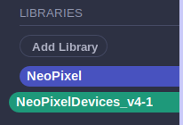

# Multiple-Neopixel-Devices-for-MicroBlocks
Daisy-chain several NeoPixel devices in series and control each device independently by name.

*How nice would it be to control two or three NeoPixel rings or panels, each independently from the others, using just one microcontroller?*

[MicroBlocks](https://microblocks.fun/) is a graphical-blocks language for programming microcontrollers. Its creators have played significant roles in developing the [Scratch](https://scratch.mit.edu/) and [Snap!](https://snap.berkeley.edu/) languages at MIT and at Berkeley, respectively. They know how to write a language.

A design goal for MicroBlocks is that a program be able to run on many, different microcontrollers. 

What this means is that, when all goes well, and subject to available memory, the same code may run without modification on an Arduino, an ESP32, a BBC micro:bit, Roger Wagner's wonderful SAMD21-based MakerPort, and many others.

## NeoPixel Devices
&ldquo;WS2811&rdquo;, popularly known as *NeoPixel*, is a type of individually-addressable, RGB LED which can be arranged in long strings, like holiday lights, or mounted on hardware such as rings or panels. 

The *NeoPixel* and *NeoPanel* libraries that come included by default with MicroBlocks are designed to work with a single string, ring or panel of NeoPixels attached to a digital output pin of a controller.

This project introduces a library that builds upon and extends those libraries to enable connecting and managing multiple NeoPixel devices.

## Contents
* [Using the Library](#using-the-library)
* [Programming Concepts](#programming-concepts-of-the-library)
* [Blocks Reference](#blocks-reference)
* [Examples](#examples)

## Using the Library
Download the library ono your computer from this repository. Its name is [NeoPixelDevices_v4-1.ubl](NeoPixelDevices_4-1.ubl).

Launch MicroBlocks, using one of the methods explained on the [web site for the language](https://microblocks.fun).

Follow instructions given on the web site to connect a microcontroller and to install the MicroBlocks firmware onto it.

Start a new program. Look for the *Add Library* link. Click it, choose Computer as the location of the library, navigate to where you stored this library, select it and click, **Open**.

Look to see whether the standard *Neopixel* library also loads, automatically. If it does not, then take a moment to add that one also to your program.

At a minimum, you want your **Libraries** palette to include these two graphical objects:

Having those two libraries installed, a typical way to initialize a MicroBlocks program for two or more NeoPixel devices could look like the example shown below as **Listing 1**.

 **Listing 1:** Initialization

## Programming Concepts of the Library
The *NeoPixelDevices* library takes advantage of how easy it is to use Lists in MicroBlocks.

The List data type in MicroBlocks can contain an arbitrary (and changeable) number of data items including numbers, text, boolean (true-false) values  and (this is the cool part) *other lists*.

Each physical device is represented by a list of five data items, forming a data record to contain its:

1. width and 
2. (optionally) its height as numbers of NeoPixels, 
3. its type (as text: ring, string or panel), 
4. a Boolean "lock" flag that can come in handy during concurrent processing, and finally 
5. a list serving as a buffer to hold each and all of the individual NeoPixel color values for the WS2811 LEDs on the device.

The library enables a program to access these different data &ldquo;fields&rdquo; by name. 

Staying with the program example begun above, a subroutine could discover and set a local variable named MaxPixel to the number of pixels on the NeoPixel ring named *Ring_24* this way:

In the previous example, **Listing 1**, a list named *DeviceChain* contains the data records for each physical device in the chain attached to the microcontroller. 

Look at the block again,

The order is important. Notice that the record for *Panel_8x8* comes first. It is worth repeating the reason why, for emphasis.

The first device record in the list should represent the physical device actually connected to the microcontroller. Other blocks in the library depend on things being set up this way. 

For the arrangement shown in this example to work right, that physical 8x8 panel should be the device attached to the controller.

Then the other data records follow in the same order as they follow outward from the controller in the physical chain.

All of the blocks for manipulating NeoPixels on a device take the device record as one of their inputs. 

Having a separate data record for each device in a chain makes it possible to draw on one device without affecting the others.

For example, building upon the initialization shown in **Listing 1**, draw a solid, green square in the center of the 8x8 NeoPixel panel.

You can draw many times into a device without affecting its visual presentation. These *NeoPixelDevices* blocks serve to prepare a device for viewing. 

Delaying the display empowers a program to prepare complex visual presentations without having each drawing step appear immediately.

When the devices are ready for display, a single block updates all of them by working through the list of device data records. For example, display the devices in the *DeviceChain* list created previously, in **Listing1**:

## Blocks Reference
The blocks are listed in the Palette area of the MicroBlocks editing window. 

Click on the *NeoPixelDevices* graphical link to reveal the list.

The blocks are shown in groups separated by spaces. In each group, the blocks share some loosely conceptual relationship with each other:

* [Physical Connection](#the-physical-connection)
* [Manage Data Records](#manage-data-records)
* [Blocks for Generic Devices](#generic-devices)
* [Blocks for Two-Dimensional Panels](#two-dimensional-panels)
* [Blocks Accessing Named Data Fields](#data-fields)

### The Physical Connection

This block tells the microcontroller which output pin attaches to the chain of physical devices.

It depends on another block that is provided in the MicroBlocks standard *NeoPixels* library, so please be sure to load that library also (in the event it does not get loaded automatically.)

### Manage Data Records

Use these blocks to create new device data records and assign them as contents of named variables.

The variable names should be descriptive of the device. For example, an 8x8 NeoPixel panel could be named *Panel_8x8*. This makes it easier for humans to read the program.

---

Use this block to transmit the NeoPixel color values from the device records in the list to the physical devices in the chain.

### Generic Devices

Sets all of the NeoPixel color values to zero for the named device. It does not affect pixel information for other devices in the chain. 

Note that the visual display of the device is not immediately updated by this block. In other words, it will not go dark right away. 

Instead, this block simply erases previous drawing instructions fropm the device and prepares the device to reflect only subsequent drawing instructions.

---

Sets the specified NeoPixel number to the given color. The block is mostly useful for one-dimensional ring-shaped devices and for strings of NeoPixels.

No other devices are affected. The visual display of the device is not immediately updated by this block.

---

Sets all of the NeoPixels of a device to the given color. 

No other devices are affected. The visual display of the device is not immediately updated by this block.

---

Rotates the NeoPixels of the device by the given number of positions.

How does it do that?

Internally, the device record structure contains a list having one item of data -- a NeoPixel color -- for each NeoPixel of the device.

This block takes the first item off the list and adds it to the end of the list. The previously second item becomes the first, and so forth until the cycle has been repeated the specified number of times.

### Two-Dimensional Panels

For all of the blocks in this group, please keep in mind that columns and rows of two-dimensional devices are numbered starting with 1. For example, an 8x8-NeoPixel panel would have columns numbered 1 through 8, rows likewise.

The code writer is responsible to ensure that the column and row number inputs are suitable for the device. Inputs outside the dimensions of the device may produce errors or unexpected results.

#### Which Way Do the Columns and Rows Lay Out?
You will notice that the blocks refer to the columns and rows generically as *x* and *y*. The reason is due to the way the NeoPixels are laid out on these devices. 

Pixel #1 is at one of the corners and has the coordinates (x-1, y=1). Pixel #2 is adjacent to it. On a typical, commonly found, *serpentine* NeoPixel panel, it has the coordinates (x=1, y=2). 

Now, when you light up Pixel #2 and look at it, will it appear at (column 2, row 1)? Or instead will it be seen at (column 1, row 2)?

The answer is, &ldquo;It depends.&rdquo; It could be either. The answer is determined by the orientation of the physical panel from the viewpoint of a person looking at it.

You have to approach this question experimentally. A project designer can learn a lot about these devices by working out the placement of a two-dimensional NeoPixel device.

Only the specified device is affected by these blocks. The visual display of the device is not immediately updated. See the *display* block, previously described.

Sets the pixel to the chosen color at the given *column,row* position on the device.

---

Set all of the NeoPixels to the chosen color in the specified column of the device.

---

Set all of the NeoPixels to the chosen color in the specified row of the device.

---

Approximate a straight line of the chosen color on the specified device from the NeoPixel at one set of (x,y) coordinates to the other set.

---

Draw a rectangle on the specified device using the chosen color, starting at the given (x,y) coordinate positon. 

Row and column coordinates for the other NeoPixels within the rectangle increase from the given x and y positions. 

The code writer is responsible to ensure that adding the values for width and height to the given x and y positions remain withing a suitable range for the device.

Extending the block reveals an optional setting to fill the rectangle with the chosen color. Setting the option to *false* will leave the rectangle unfilled.

---

Draw a circle on the specified device using the chosen color, placing the origin (center) at the given (x,y) coordinate positon.

Row and column positions for the other NeoPixels within the circle both increase and decrease from the given x and y positions. 

The code writer is responsible to ensure that pixel positions obtained by adding and subtracting the radius will remain suitable for the device.

Extending the block reveals an optional setting to fill the circle with the chosen color. Setting the option to *false* will leave the circle unfilled.

### Data Fields

This block reports the contents of a named data field in the specified device record. Select a name from the dropdown menu.

---

This block and the two that follow below are designed to help a program writer avoid data corruption in concurrent (that is, multitasking) program designs. 

The idea is to regulate the execution of the program in such a way that only one script will access a data object at any given time. 

Data corruption can occur when one script starts writing data to an object while another script is reading the object, or if both scripts are trying to write the data simultaneously.

*Locking* a data object is one way to guard against such situations.

This block pauses execution of a script when it finds the specified object to be locked, indicating another script is using the object.

Execution is allowed to resumes after the other script unlocks the object. 

See the *concurrent processing* example. The program sets up a chain of two devices and defines a graphical object to animate on each of them. Then it launches three, separate scripts that run concurrently:

* draw on the panel every 127 milliseconds
* draw on the ring every 179 milliseconds
* display both the panel and the ring every 79 milliseconds

From time to time one of the scripts will pause while one of the device data records remains locked by another script. Yet, the animation proceeds smoothly and the graphical object always appears correctly on both devices.

---

Set the *lock* field in the data record of the specified device to *true*. 

Other scripts may check this field to determine whether it is OK for them to access the data for that device.

---

Set the *lock* field in the data record of the specified device to *false*.

This setting indicates that no script is using the object, implying that the device data record is available for reading or writing.

## Examples

Presently there are three example programs.

All of the programs are customized to work with a device chain arranged in a certain way:

First: a two-dimensional NeoPixel panel having 8 rows and 8 columns of NeoPixels. IMPORTANT: the panel must be of the *serpentine* layout, which is how most of them are produced.

Second: a ring-shaped device having 24 NeoPixels on it.

Comments in the programs provide some documentation about what is going on.

Closer study of the code is left as an exercise for the reader.

I expect to write more about the examples. Please consider checking back here from time to time.