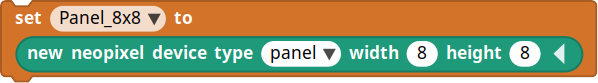

# Multiple-NeoPixel-Devices-for-MicroBlocks
Daisy-chain several NeoPixel devices in series and control each device independently by name.

*How nice would it be to control two or more NeoPixel rings or panels, each independently from the others, using just one microcontroller?*

[MicroBlocks](https://microblocks.fun/) is a graphical-blocks language for programming microcontrollers. Its creators have played significant roles in developing the [Scratch](https://scratch.mit.edu/) and [Snap!](https://snap.berkeley.edu/) languages at MIT and at Berkeley, respectively. They know how to write a language.

A design goal for MicroBlocks is that a program be able to run on many, different microcontrollers. 

What this means is that, when all goes well, and subject to available memory, the same code may run without modification on an Arduino, an ESP32, a BBC micro:bit, Roger Wagner's wonderful SAMD21-based MakerPort, and many others.

## NeoPixel Devices
&ldquo;WS2811&rdquo;, popularly known as *NeoPixel*, is a type of individually-addressable, RGB LED which can be arranged in long strings, like holiday lights, or mounted on hardware such as rings or panels. 

The *NeoPixel* and *NeoPanel* libraries that come included by default with MicroBlocks are designed to work with a single string, ring or panel of NeoPixels attached to a digital output pin of a controller.

This project introduces a library that builds upon and extends those libraries to enable connecting and managing multiple NeoPixel devices.

How many devices can be chained together this way? It depends on the number and sizes of the devices and on the available memory in the microcontroller. The example illustrated here, using two devices, was tested with a MakerPort.

## Contents
* [Using the Library](#using-the-library)
* [Blocks Reference](#blocks-reference)
* [Examples](#examples)
* [Programming Concepts](#programming-concepts-of-the-library)

## Using the Library

### Installation
Download the library onto your computer from this repository. Its name is [NeoPixelDevices_v4-2.ubl](NeoPixelDevices_v4-2.ubl).

Launch MicroBlocks, using one of the methods explained on the [web site for the language](https://microblocks.fun).

Follow instructions given on the web site to connect a microcontroller and to install the MicroBlocks firmware onto it.

### Add the Library to a New Program

Start a new program. Look for the *Add Library* link. Click it, choose Computer as the location of the library, navigate to where you stored this library, select it and click, **Open**.

Look to see whether the standard *NeoPixel* library also loads, automatically. If it does not, then take a moment to add that one also to your program.

At a minimum, you want your **Libraries** palette to include these two graphical objects:

### First Steps

Having those two libraries installed, a typical way to initialize a MicroBlocks program for a chain of two NeoPixel devices could look like the example shown below as **Listing 1**.

 **Listing 1:** Initialization

Look more closely at these instructions. The first green block tells MicroBlocks to transmit signals to the chain of devices through I/O pin number 15.

### Assign Names to Your Devices

Create a variable name for each device in the chain. It is a good idea to choose descriptive names, because it makes the code easier for humans to read and to understand. 

&ldquo;Panel_8x8&rdquo; and &ldquo;Ring_24&rdquo; in **Listing 1**, above, are variable names that would serve well for an 8-by-8 NeoPixel panel and for a 24-NeoPixel ring device, respectively. 

The next, two blocks in **Listing 1** initialize each of the variables to contain a *data record* with distinct information specific to each device. 

For example, the block shown below configures the data record stored in the &ldquo;Panel_8x8&rdquo; variable to work with a NeoPixel panel having eight rows of eight NeoPixels each: 

Using named variables to contain different data records for each of the different devices enables a program to access the different devices individually, by name.

In the discussion that follows, the phrase &ldquo;data record&rdquo; will refer to the variable that contains information about a particular NeoPixel device. 

### Make a List of Your Devices

After naming variables to represent the devices and preparing their initial data records, your program will need to create a list representing the entire chain of NeoPixel devices attached to the microcontroller.

In **Listing 1**, a variable named *DeviceChain* is set to contain a list of the data records for the two devices, as follows:

The order is important. Notice that the record for *Panel_8x8* comes first. It is worth repeating the reason why, for emphasis.

The first device record in the list should represent the physical device actually connected to the microcontroller. Other blocks in the library depend on things being set up this way. 

For the arrangement shown in this example to work right, that physical 8x8 panel should be the device attached to the controller.

Then the other data records follow in the same order as the devices follow outward from the controller in the physical chain.

### Draw Onto a Named Device 

All of the blocks for manipulating NeoPixels on a device take the corresponding variable name for the device as one of their inputs. 

Using the name allows a program to change NeoPixels on one device without affecting the others.

For example, building upon the initialization shown in **Listing 1**, draw a solid, green square in the center of the 8x8 NeoPixel panel.

You can draw many times into a device without immediately affecting its visual presentation.

Delaying the display empowers a program to prepare complex visual presentations without having each drawing step appear right away.

### Display New Drawing Whenever You Choose

When the program is ready to display changes, a single block updates all of devices in the chain by working through the list of device data records. For example, display the devices in the *DeviceChain* list:

[back to Contents](#contents)

## Programming Concepts of the Library
This part explains how the *NeoPixelDevices* library works. You can skip over it if you just want to play with the blocks. Come back later to learn more.

But wait.

Before you go, there is one thing you should know about those data records. Each record keeps track of several, different pieces of information about a NeoPixel device. The discussion that follows will refer to each of those pieces of information as a *field*. 

For example, the number of NeoPixels in one &ldquo;row&rdquo; on a panel is stored in a field named *width*. The number of &ldquo;rows&rdquo; is kept in a field named *height*. If the device is a ring or a strand of NeoPixels, then it has only one &ldquo;row&rdquo;, and the *height* field would be set to 1 by default. 

OK, you can safely [skip ahead to the blocks reference](#blocks-reference) now, if you wish.

The *NeoPixelDevices* library takes advantage of how easy it is to use Lists in MicroBlocks.

The List data type in MicroBlocks can contain an arbitrary (and changeable) number of data items, and the data items can be any of the types supported by MicroBlocks, including:
* text, 
* numbers, 
* boolean (true-false) values and 
* (this is the cool part) *other lists*.

Each physical NeoPixel device is represented in this library by a list of five data items, forming a data record to contain its:

1. width and 
2. (optionally) its height as numbers of NeoPixels, 
3. its type (as text: &lsquo;ring&rsquo;, &lsquo;string&rsquo; or &lsquo;panel&rsquo;), 
4. a Boolean "lock" flag that can come in handy during concurrent processing, and finally 
5. a list serving as a buffer to hold each and all of the individual NeoPixel color values for the WS2811 LEDs on the device.

Importantly, keeping all five of these data items, or *fields*, together in a single list makes it possible to assign them as a group, as a *data record* to be stored in a single, named variable. 

Behind the scenes, the *NeoPixelDevices* library maintains a list of names for these different fields. It uses this list to figure out how to look up a value in a device data record by name. 

In this way, a program is able to use names for everything.  It can refer &mdash; by name &mdash; both to the devices and to the different fields of data for each device. It is similar to the concept of a *struct* or a *record* in some other languages, though not quite.

The library provides a *new NeoPixel device* block which takes care of setting up all five of the *fields* in one of these device data lists.

Combining that block with the standard, built-in *set* block of MicroBlocks, the device data record becomes stored in a named variable. 

## Blocks Reference
The blocks are listed in the Palette area of the MicroBlocks editing window. 

Click on the *NeoPixelDevices* graphical link to reveal the list.

The blocks are shown in groups separated by spaces. In each group, the blocks share some loosely conceptual relationship with each other:

* [Physical Connection](#the-physical-connection)
* [Manage Data Records](#manage-data-records)
* [Blocks for Generic Devices](#generic-devices)
* [Blocks for Two-Dimensional Panels](#two-dimensional-panels)
* [Blocks Accessing Named Data Fields](#data-fields)

### The Physical Connection

This block tells the microcontroller which output pin attaches to the chain of physical devices.

It depends on another block that is provided in the MicroBlocks standard *NeoPixels* library, so please be sure to load that library also (in the event it does not get loaded automatically.)

[back to Contents](#contents)

### Manage Data Records
Use the following block for one-dimensional devices such as the rigid ring-shaped ones or flexible strands of holiday lights.

Enter the number of NeoPixels on the ring or in the strand as the *width* of the device.

Extending the block reveals an optional, second input, as shown below. In this form, the program can input both the *width* and the *height* of a two-dimensional NeoPixel panel.

Use these blocks as inputs to the MicroBlocks standard *set* block, as shown in **Listing 1**. to create new device data records and assign them as contents of named variables.

Here is another look at that:

Names of variables should be descriptive of the data they contain. For example, *Panel_8x8* looks informative for the variable containing a data record for an 8x8 NeoPixel panel.  

Naming variables this way is nothing more than a personal choice of programming style. Doing so can make it easier for humans to read the program. However, the name of a variable has no effect on how a program will work.

---

Use this block to transmit the NeoPixel color values from the device records in the list to the physical devices in the chain.

[back to Contents](#contents)

### Generic Devices

Sets all of the NeoPixel color values to zero for the named device. As with all of the other &ldquo;drawing blocks&rdquo; in this library, it does not alter any pixel information for other devices in the chain. 

This block is typically used to erase previous drawing instructions from the device in preparation for subsequent drawing instructions.

---

Sets the specified NeoPixel number to the given color. The block is mostly useful for one-dimensional ring-shaped devices and for strings of NeoPixels.

---

Sets all of the NeoPixels of a device to the given color. 

---

Rotates the NeoPixels of the device by the given number of positions.

How does it do that?

Internally, the device record structure contains a list having one item of data -- a NeoPixel color -- for each NeoPixel of the device.

This block takes the first item off the list and adds it to the end of the list. The previously second item becomes the first, and so forth until the cycle has been repeated the specified number of times.

[back to Contents](#contents)

### Two-Dimensional Panels

For all of the blocks in this group, please keep in mind that columns and rows of two-dimensional devices are numbered starting with 1. For example, an 8x8-NeoPixel panel would have columns numbered 1 through 8, rows likewise.

The code writer is responsible to ensure that the column and row number inputs are suitable for the device. Inputs outside the dimensions of the device may produce errors or unexpected results.

#### Which Way Do the Columns and Rows Lay Out?
You will notice that the blocks refer to the columns and rows generically as *x* and *y*. The reason is due to the way the NeoPixels are laid out on these devices. 

Pixel #1 is at one of the corners and has the coordinates (x=1, y=1). Pixel #2 is adjacent to it. On a typical, commonly found, *serpentine* NeoPixel panel, it has the coordinates (x=1, y=2). 

Now, when you light up Pixel #2 and look at it, will it appear at (column 2, row 1)? Or instead will it be seen at (column 1, row 2)?

The answer is, &ldquo;It depends.&rdquo; It could be either. The answer is determined by the orientation of the physical panel from the viewpoint of a person looking at it.

You have to approach this question experimentally. A project designer can learn a lot about these devices by working out the placement of a two-dimensional NeoPixel device.

Only the specified device is affected by these blocks. The visual display of the device is not immediately updated. See the *display* block, previously described.

Sets the pixel to the chosen color at the given (*x*,*y*) position on the device.

---

Set all of the NeoPixels to the chosen color in the specified &ldquo;column&rdquo; of the device.

As noted previously, whether the result looks like a column, and not a row, depends upon the placement of the physical device and the viewpoint of the observer.

---

Set all of the NeoPixels to the chosen color in the specified &ldquo;row&rdquo; of the device.

The result will lay perpendicular to that obtained by the *fill column* block described above.

Again, whether the result looks like a row, and not a column, depends upon the placement of the physical device and the viewpoint of the observer.

---

Approximate a straight line of the chosen color on the specified device from the NeoPixel at one set of (*x*,*y*) coordinates to the other set.

---

Draw a rectangle on the specified device using the chosen color, starting at the given (*x*,*y*) coordinate positon. 

*x* and *y* coordinates for the other NeoPixels within the rectangle increase from the given *x* and *y* positions. 

The code writer is responsible to ensure that values obtained by adding width and height to the given x and y positions remain withing a suitable range for the device.

Extending the block reveals an optional setting to fill the rectangle with the chosen color. Setting the option to *false* will leave the rectangle unfilled.

---

Draw a circle on the specified device using the chosen color, placing the origin (center) at the given (*x*,*y*) coordinate positon.

*x* and *y* coordinates for the other NeoPixels within the circle both increase and decrease from the given *x* and *y* positions. 

The code writer is responsible to ensure that values obtained by adding and subtracting the radius will remain suitable for the device.

Extending the block reveals an optional setting to fill the circle with the chosen color. Setting the option to *false* will leave the circle unfilled.

[back to Contents](#contents)

### Data Fields

This block reports the contents of a named data field in the specified device record. Select a name from the dropdown menu.

---

This block and the two that follow below are designed to help a program writer avoid data corruption in concurrent (that is, multitasking) program designs. 

This block pauses execution of a script when it finds the specified object to be locked, indicating another script is using the object.

Execution is allowed to resume after the other script unlocks the object. 

See [Locking a Data Object](#locking-a-data-object-for-concurrent-execution)

---

Set the *lock* field in the data record of the specified device to *true*. 

Other scripts may check this field to determine whether it is OK for them to access the data for that device.

See [Locking a Data Object](#locking-a-data-object-for-concurrent-execution)

---

Set the *lock* field in the data record of the specified device to *false*.

This setting indicates that no script is using the object, implying that the device data record is available for reading or writing.

### Locking a Data Object for Concurrent Execution

The idea is to regulate the execution of the program in such a way that only one script will access a data object at any given time. 

Data corruption can occur when one script starts writing data to an object while another script is reading the object, or when more than one script writes to the data object simultaneously.

*Locking* a data object is one way to guard against such situations.

It is a *cooperative* technique. MicroBlocks will not prevent a program from writing to a data object that happens to have a *lock flag* set to *true* in this way. 

The technique works only when all of the scripts in the program abide by the *lock* settings 

It means the programmer has to design concurrent scripts so that they properly set, clear and respect *lock* flags that the programmer has provided to protect critical data. 

See the *concurrent processing* example. The program sets up a chain of two devices and defines a graphical sprite (the &ldquo;snake&rdquo;) to animate on each of them. Then it launches three, separate scripts that run concurrently:

* draw the snake at a new position on the panel every 127 milliseconds
* draw on the snake at a new position on the ring every 179 milliseconds
* display both the panel and the ring every 79 milliseconds

From time to time one of the scripts will probably have to pause while one of the device data records remains locked by another script. Yet, the animation proceeds smoothly and the snake slithers along its way correctly on both devices.

[back to Contents](#contents)

## Examples

Presently there are three example programs.

All of the example programs are custom-tailored to work with a device chain arranged in a certain way:

First: a two-dimensional NeoPixel panel having 8 rows and 8 columns of NeoPixels. IMPORTANT: the panel must be of the *serpentine* layout, which is how most of them are produced.

Second: a ring-shaped device having 24 NeoPixels on it.

Comments in the programs provide some documentation about what is going on.

Closer study of the code is left as an exercise for the reader.

The reader may notice that the names given to the variables holding data records for the devices are slightly different from one example to the next. This variation was done on purpose for the following reason.

While the names aim to be *descriptive* for the devices in each example, it is important to recognize that there is no magic in the name of the variable. The *NeoPixelDevices* library takes no information from the name of a variable. It looks only at the information that is written into the fields of the data record stored in the variable.

I expect to write more about the examples. Please consider checking back here from time to time.

[back to top](#multiple-NeoPixel-devices-for-microblocks)
